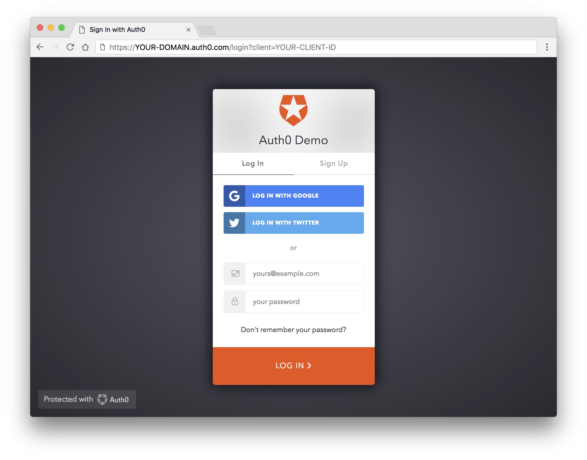

# 🔑 Auth

> Nuxt.js的身份认证模块

## 使用

yarn 和 npm 安装:

```js
yarn add @nuxtjs/auth @nuxtjs/axios
OR
npm install @nuxtjs/auth @nuxtjs/axios
```

nuxt.config.js

```js
module.exports = {
  modules: [
    '@nuxtjs/axios',
    '@nuxtjs/auth'
  ],
​
  auth: {
    // Options
  }
}
```

添加到新的Nuxt项目时，请确保已使用了Vuex存储。有关如何执行此操作的更多信息，请参阅 `auth-moduleNuxt` [入门指南](https://nuxtjs.org/guide/vuex-store)

## 中间件

可以在全局或每条路由启用 `auth` 中间件。当在路由上启用此中间件并且 `loggedIn` 为 `false` 时，用户将被重定向到 `redirect.login` 路由。(默认为 `/login`)

路由设置:

```js
export default {
  middleware: 'auth'
}
```

在nuxt.config.js中使用全局配置:

```js
router: {
  middleware: ['auth']
}
```

在全局使用的情况下，您可以在特定组件中将 `auth` 选项设置为 `false`，而中间件将忽略该路由。

```js
export default {
  auth: false
}
```

## 选项

### redirect

默认: 

```js
redirect: {
  login: '/login',
  logout: '/',
  home: '/',
  callback: '/login',
}
```

- `login`: 如果需要登录，用户将被重定向到此路径。
- `logout`: 如果在注销后，当前路由受到保护，用户将被重定向到此路径。
- `home`: 登录后，用户将重定向到此路径。（将重写此路径）
- `callback`: 登录后，将用户重定向到此路径。（应该配置匹配 `允许回调URL` （或类似设置）在你的应用程序/客户端。

通过设置为false，可以禁用每个重定向路径。还可以通过将 `redirect` 设置为 `false` 禁用所有重定向

### watchLoggedIn

- Default: `true`

当启用（默认）时，用户将在登录/注销时重定向。

### token

Auth token在用户登录时存储在各种存储（cookie、localStorage、vuex）中，以提供跨服务器端呈现（SSR）和客户端呈现的无缝auth体验。token以以下格式的存储键存储:`{storageProvider.prefix}{token.prefix}{strategy}`。有关详细信息，请参阅[auth.js - Token helpers](https://github.com/nuxt-community/auth-module/blob/master/lib/core/auth.js#L160)帮助程序和[storage.js](https://github.com/nuxt-community/auth-module/blob/master/lib/core/storage.js)。


默认: 

```js
token: {
  prefix: '_token.'
}
```

- prefix - 用于构建跨所有存储token密钥的前缀

### localStorage

默认: 

```js
localStorage: {
  prefix: 'auth.'
}
```

- prefix - token前缀，用于浏览器本地存储中的token存储构建密钥

可以通过将 `localStorage` 设置为 `false` 来禁用localStorage的使用，如下:

```js
localStorage: false
```

否则，身份验证token将以默认密钥存储在localStorage中: auth._token.{provider}。

### cookie

默认: 

```js
cookie: {
  prefix: 'auth.',
  options: {
    path: '/'
  }
}
```

- prefix - 在浏览器的localStorage中为token存储构建密钥时使用的默认前缀
- options - cookie选项，通过[js-cookie](https://github.com/js-cookie/js-cookie) `set` 和 `get`函数。有关它们支持的选项及其默认值的详细信息，请参阅[这里](https://github.com/js-cookie/js-cookie#cookie-attributes)，包括:
  - `path` - cookie的路径。默认为 '/'。
  - `expires` - 可以用来指定cookie生存期的天数或特定日期，默认为 session。
  - `domain` - cookie中可以看到的域（以及扩展子域/s）。默认是域和所有子域。
  - `secure` - 这是一个安全协议(https)。默认是false。如果可能，应该设置为true。

注意: 要使用JWT token，SSR请求需要使用cookie。

通过将 `cookie` 设置为 `false`，可以禁用cookie存储。如下: 

```js
cookie: false
```

否则这个auth token将存储在默认名为: `auth._token.{provider}`。

### plugins

如果您有任何依赖于$auth的nuxt插件，则必须在这里指定它，而不是在nuxt.config.js插件选项中指定。

[扩展验证](#recipes)

### resetOnError

- Default: `false`

如果启用，如果发生任何错误，用户将自动注销（例如token过期）

### rewriteRedirects

- Default: `true`

如果启用，用户将重定向回原来的路由，而不是redirect.home

### fullPathRedirect

- Default: `false`

如果为true，则使用于带有重定向查询参数的完整路由路径。

### vuex.namespace

- Default: `auth`

vuex存储用于保持状态的管理器。

### scopeKey

- Default: `scope`

用于范围检查的 `user` 对象属性（hasScope），可以是数组也可以是对象。

## 参考

### **Schemes**

方案定义了身份验证逻辑。策略是Scheme的可配置实例。您可以在项目中使用多个方案和策略。

`auth.strategies` 选项是一个对象。键是策略名称，值是配置。

```js
auth: {
  strategies: {
    local: { /* ... */ },
    github: { /* ... */ },
  }
}
```

默认情况下，实例名称与方案名称相同，如果希望通过提供自己的方案或具有相同方案的多个实例获得更大的扩展性，可以使用 `_scheme` 属性:

```js
auth: {
  strategies: {
    local1: { _scheme: 'local', /* ... */ },
    local2: { _scheme: 'local', /* ... */ },
    custom: { _scheme: '~/app/customStrategy.js', /* ... */ },
  }
}
```

### Local

[源码](https://github.com/nuxt-community/auth-module/blob/dev/lib/schemes/local.js)

`local` 是默认通用认证方案，支持 `Cookie` 和 `JWT` 登录流程。

默认情况下启用和预配置local方案。

> 提示：您可以将 `strategies.local` 设置 `false` 以禁用它。

#### 用法

```js
auth: {
  strategies: {
    local: {
      endpoints: {
        login: { url: '/api/auth/login', method: 'post', propertyName: 'token' },
        logout: { url: '/api/auth/logout', method: 'post' },
        user: { url: '/api/auth/user', method: 'get', propertyName: 'user' }
      },
      // tokenRequired: true,
      // tokenType: 'bearer',
    }
  }
}
```

#### endpoints

每个属性用于使用axios进行请求。它们基本上扩展了Axios [请求配置](https://github.com/axios/axios#request-config)

> 提示：要禁用每个属性，只需将其值设置为false。

#### propertyName

`propertyName` 可用于指定使用响应JSON的哪个字段作为值。`undefined` 可以直接使用API​​响应，或者像 `auth.user` 更复杂。

#### tokenRequired

此选项可用于禁用所有token。仅用于Cookie。

#### tokenType

- Default: `Bearer`

在axios请求中使用的授权头类型。

#### 使用

通过将凭据作为JSON对象在请求体中发送，执行基于密码的登录:

```js
this.$auth.loginWith('local', {
  data: {
    username: 'your_username',
    password: 'your_password'
  }
})
```

### Oauth2

[源码](https://github.com/nuxt-community/auth-module/blob/dev/lib/schemes/oauth2.js)

`oauth2` 支持各种oauth2登录流程。您也可以自定义配置，而不是直接使用此方案。

#### 用法

```js
auth: {
  strategies: {
    social: {
      _scheme: 'oauth2',
      authorization_endpoint: 'https://accounts.google.com/o/oauth2/auth',(必选)
      userinfo_endpoint: 'https://www.googleapis.com/oauth2/v3/userinfo',(必选)
      scope: ['openid', 'profile', 'email'],
      response_type: 'token',
      token_type: 'Bearer',
      redirect_uri: undefined,
      client_id: 'SET_ME',(必选)
      token_key: 'access_token'
    }
  }
}
```

#### authorization_endpoint

必选 - 启动登录流程的属性。取决于oauth服务。

#### userinfo_endpoint

虽然不是oauth2规范的一部分，几乎所有的oauth2都公开这个属性以获取用户配置文件。如果设置了错误值，我们只登录而不获取用户配置文件。

#### scope

必选 - Oauth2访问范围

#### response_type

默认值是 `token`，如果使用 `code`，则必须实现服务器端逻辑来对响应代码进行签名。

#### token_type

默认值是 `Bearer`，它将用于axios请求的 `Authorization` 头部。

#### redirect_uri

默认情况下，它将从`redirect.callback`选项推断。(默认为 `/login`)

应该与登录页面或相对路径相同的页面。[示例](https://github.com/nuxt-community/auth-module/blob/dev/examples/demo/pages/callback.vue)

#### client_id

必选 - oauth2客户端ID。

#### token_key

默认情况下，设置为token_key: `access_token`。如果需要使用IdToken而不是AccessToken，将此选项设置为token_key：`id_token`。

#### refresh_token_key

默认情况下，设置为refresh_token_key: `refresh_token`。如果存在，它将自动存储refresh_token。

#### 使用

```js
this.$auth.loginWith('social')
```

### Providers

Providers 是Schemes之上的抽象。它们使得与流行的身份验证服务集成变得非常容易。他们可以通过提供程序所需的服务器端更改（例如 token 签名）执行更多操作，您也可以自己编写。

[源码](https://github.com/nuxt-community/auth-module/blob/dev/lib/providers/auth0.js)

#### 用法

```js
auth: {
  strategies: {
    auth0: {
      domain: 'domain.auth0.com',
      client_id: '....'
    }
  }
}
```

在项目逻辑中的任何地方:

```js
this.$auth.loginWith('auth0')
```

用户将被重定向到如下页面:



💁此程序基于[oauth2方案](#oauth2)，并支持所有方案选项。

获取 `client_id` and `domain`

需要这些选项。您的应用程序需要关于这个客户端的一些细节来与Auth0通信。您可以从 [Auth0 dashboard](https://auth0.auth0.com/login?state=g6Fo2SBWajVOV2w4b3FULXlEMzJlT3F2NWRHWnhldHlCSFZsdaN0aWTZMmdhRm8yU0EyV2sxNU0xSXlibnBmTlRSSlUzTkhkVVZsVVROSlZIWTFla2hhUTBrMVpno2NpZNkgekVZZnBvRnpVTUV6aWxoa0hpbGNXb05rckZmSjNoQUk&client=zEYfpoFzUMEzilhkHilcWoNkrFfJ3hAI&protocol=oauth2&response_type=code&redirect_uri=https%3A%2F%2Fmanage.auth0.com%2Fcallback&scope=openid%20profile%20name%20email%20nickname%20created_at) 中的客户端设置部分获得这些详细信息。


#### Facebook

[源码](https://github.com/nuxt-community/auth-module/blob/dev/lib/providers/facebook.js)

```js
auth: {
  strategies: {
    facebook: {
      client_id: '...',
      userinfo_endpoint: 'https://graph.facebook.com/v2.12/me?fields=about,name,picture{url},email,birthday',
      scope: ['public_profile', 'email', 'user_birthday']
    },
  }
}
```

在项目逻辑中的任何地方:

```js
this.$auth.loginWith('social')
```

💁此程序基于[oauth2方案](#oauth2)，并支持所有方案选项。

获取 `client_id`

此选项是必需的。要获得一个，请在[Facebook Developers](https://developers.facebook.com/)中创建您的应用程序并添加"Facebook Login"产品。然后设置有效的回调URL。客户端ID与"App ID"相同。

#### Github

[源码](https://github.com/nuxt-community/auth-module/blob/dev/lib/providers/github.js)

```js
auth: {
  strategies: {
      github: {
        client_id: '...',
        client_secret: '...'
      },
  }
}
```

在项目逻辑中的任何地方:

```js
this.$auth.loginWith('github')
```

💁此程序基于[oauth2方案](#oauth2)，并支持所有方案选项。

获取 `client_id` 和 `client_secret`

此选项是必需的。要获得一个，请在创建新的[Oauth APP](https://github.com/settings/applications/new)中创建您的应用程序，并使用提供的"客户端ID"和"客户端密钥"。

#### Google

[源码](https://github.com/nuxt-community/auth-module/blob/dev/lib/providers/google.js)

```js
auth: {
  strategies: {
      google: {
        client_id: '...'
      },
  }
}
```

在项目逻辑中的任何地方:

```js
this.$auth.loginWith('google')
```

💁此程序基于[oauth2方案](#oauth2)，并支持所有方案选项。

获取 `client_id`

此选项是必需的。要获取一个，请在[Google API控制台中](https://console.developers.google.com/projectselector/apis/dashboard?supportedpurview=project)创建您的应用，创建一个新项目，然后从"凭据"标签中创建一个新的"Oauth客户端ID"。

#### Laravel Passport

[源码](https://github.com/nuxt-community/auth-module/blob/dev/lib/providers/laravel.passport.js)

```js
auth: {
  strategies: {
      'laravel.passport': {
        url: '...',
        client_id: '...',
        client_secret: '...'
      },
  }
}
```

在项目逻辑中的任何地方:

```js
this.$auth.loginWith('laravel.passport')
```

💁此程序基于[oauth2方案](#oauth2)，并支持所有方案选项。

获取 `url`、`client_id` 和 `client_secret`

这些选项是必需的。在[Laravel应用程序](https://laravel.com/docs/5.6/passport#managing-clients)中创建一个新的客户端应用程序，并且获取 `url`、`client_id` 和 `client_secret`。

## API

### Auth

[源码](https://github.com/nuxt-community/auth-module/blob/dev/lib/core/auth.js)

该模块全局注入`$auth`实例，这意味着您可以使用`this.$auth`在任何地方访问它。对于plugins、asyncData、fetch、nuxtServerInit和Middleware，您可以从`context.app.$auth`中访问它。

#### 性能

所有属性都是被动的。这意味着您可以在Vue模板`v-if`条件下安全地使用它们。

#### `user`

此对象包含有关已认证用户的详细信息，例如名称。您可以使用`$auth`或Vuex 访问它。

```js
// 使用 $auth
this.$auth.user
​
// 在 vuex 中使用
this.$store.state.auth.user
```

#### `loggedIn`

此布尔标志表示用户此时已经过身份验证且可用。

```js
// 使用 $auth
this.$auth.loggedIn
​
// 在 vuex 中使用
this.$store.state.auth.loggedIn
```

在这使用的背后，需要auth使用[$storage](#storage)附加实例来提供此状态。

#### methods

`loginWith(strategyName, ...args)`

- Returns: `Promise`

将当前策略设置为`strategyName`并尝试登录。用法因当前策略而异。

```js
this.$auth.loginWith('local', /* .... */)
  .then(() => this.$toast.success('Logged In!'))
```

#### `login(...args)`

- Returns: `Promise`

使用主动策略登录。用法因当前策略而异。
> 提示：建议使用 `loginWith` 而不是这个函数！

```js
this.$auth.login(/* .... */)
  .then(() => this.$toast.success('Logged In!'))
```

#### `logout()`

- Returns: `Promise`

退出活动策略。用法因当前方案而异。

```js
await this.$auth.logout()
```

#### `fetchUser()`

- Returns: `Promise`

使用策略强制重新获取用户。

```js
await this.$auth.fetchUser()
```

#### `hasScope(scopeName)`

检查用户是否具有特定范围：

```js
// 返回是一个计算属性的布尔值
this.$auth.hasScope('admin')
```

#### `setToken(strategy, token)`

通用设置token。该`name`参数是可选的，默认为`options.token.name`。

```js
// 更新 token
this.$auth.setToken('local', '.....')
```

#### `onError(handler)`

侦听身份验证错误: (`plugins/auth.js`)

```js
export default function({ $auth }) {
  $auth.onError((error, name, endpoint) => {
    console.error(name, error)
  })
}
```

### Storage

[源码](https://github.com/nuxt-community/auth-module/blob/dev/lib/core/storage.js)

Auth模块具有强大的内置Universal Storage，可保存token和配置文件数据。

#### Universal Storage

普遍vuex保持状态为localStorage和Cookies：

```js
this.$auth.$storage.setUniversal(key, val, isJson)
this.$auth.$storage.getUniversal(key, isJson)
this.$auth.$storage.syncUniversal(key, defaultValue, isJson)
```

#### Local Stat

Access to local state:

```js
this.$auth.$state
// OR
this.$auth.$storage.$state
```

```js
this.$auth.$storage.setState(key, val)
this.$auth.$storage.getState(key)
​
// Watch state changes
this.$auth.$storage.watchState('loggedIn', newValue => { })
```

#### Cookies

```js
this.$auth.$storage.setCookie(key, val, isJson)
this.$auth.$storage.getCookie(key)
```

#### Local Storage

```js
this.$auth.$storage.setLocalstorage(key, val, isJson)
this.$auth.$storage.getLocalstorage(key)
```

## Recipes

### Extend Auth

如果有需要访问$auth的插件，可以使用auth.plugins选项

`nuxt.config.js`

```js
{
  modules: {
    '@nuxtjs/auth'
  },
  auth: {
     plugins: [ '~/plugins/auth.js' ]
  }
}
```

`plugins/auth.js`

```js
export default function ({ app }) {
  if (!app.$auth.loggedIn) {
    return
  }
​
  const username = app.$auth.user.username
}
```

## 链接

[示例](https://github.com/nuxt-community/auth-module/)

[Github](https://auth.nuxtjs.org/meta/migration)
